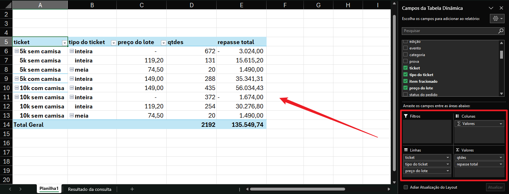
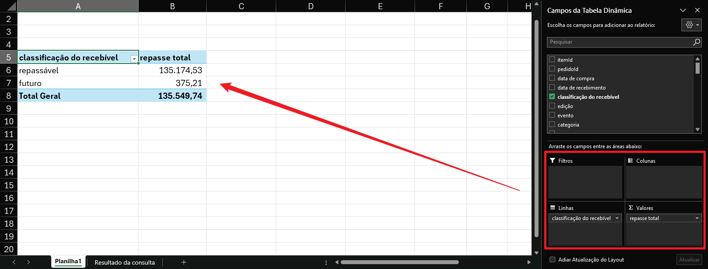

# RECEBÍVEIS

## 1. Introdução

Consulta focada em `checkoutsummary`, de modo que (quase) tudo seja editado de modo físico dentro da própria tabela:

* **`sessionId`**: Nº do pedido;
* **`totalAmount`**: Valor total do pedido;
* **`ticketsValue`**: Total bruto de tickets no pedido;
* **`productsValue`**: Total de plugins no pedido (já líquido pois plugins não sofrem dedução via cupom);
* **`discount`**: Total de desconto de cupom no pedido;
* **`interest`**: Total de juros no pedido (inteiramente da GoDream);
* **`freight`**: Total de frete no pedido (inteiramente da GoDream);
* **`tax`**: Total de conveniência no pedido (receita principal da GoDream);
* **`ticketInsurance`**: Total de seguro/reembolso no pedido (receita da GoDream precisa ser apurada via consulta);
* **`ticketTransfer`**: Total de transferência de tickets no pedido (receita da GoDream precisa ser apurada via consulta).

**NOTA:** Por consultar dados físicos, alterar a taxa de conveniência cadastrada, desconto de cupons, taxas de frete/juros/seguro e valor de transferência de tickets não impactará pedidos já realizados. Contudo, o valor cadastrado de um ticket ou plugin ainda impactará devido ao rateio.

## 2. Campos de ajuste manual

Na tabela `eventcomplement`:

* **emissionChargePercent**: Percentual de receita da GoDream sobre a emissão de um ticket. Deduz do valor líquido do ingresso;
* **emissionChargeFixed**: Valor fixo por ticket emitido, deduzido do faturamento do produtor;
* **comissionSecurityPerc**: Percentual de receita sobre o valor pago de seguro/reembolso no pedido;
* **transferPercent**: Percentual sobre o valor pago de tranferência de tickets de receita da GoDream;
* **productChargePercent**: Percentual de receita sobre o valor dos plugins vendidos;
* **productChargeFixed**: Valor fixo de receita de cada plugin vendido.

Na tabela `eventticketcomplement`:

* **category**: Para indicar se é `ticket`, `extra`, ou outra coisa;
* **emissionChargePercent**: Mesmo campo da tabela `eventcomplement`;
* **emissionChargeFixed**: Mesmo campo da tabela `eventcomplement`;
* **comissionSecurityPerc**: Mesmo campo da tabela `eventcomplement`;
* **transferPercent**: Mesmo campo da tabela `eventcomplement`.

Na tabela `productcomplementmanual`:

* **category**: Para indicar se é `ticket`, `extra`, ou outra coisa;
* **productChargePercent**: Mesmo campo da tabela `eventcomplement`;
* **productChargeFixed**: Mesmo campo da tabela `eventcomplement`.

A razão para haver tabelas com a mesma informação é poder controlar se um plugin for cadastrado como ticket e vice-versa (como em lojas de serviço, as quais extras foram casdastrados como tickets). A prioridade é sobre o que estiver cadastrado em `eventticketcomplement` e `productcomplementmanual` - caso os campos nas respectivas tabelas seja nulo ou zero, retorna os valores armazenados em `eventcomplement`. Para as 3 tabelas o default é zero. Dessa forma, se um extra for cadastrado como ingresso, ele constará em `eventticket` e pode-se definir `category` como "extra" e estabelecer `emissionChargePercent` e `emissionChargeFixed` específicos.

## 3. Schema da tabela retornada

```
+---------------------------------+-------------------------------------------------------------------------------------------------------------------------------------------------------+
| CAMPO                           | DESCRIÇÃO                                                                                                                                             |
+---------------------------------+-------------------------------------------------------------------------------------------------------------------------------------------------------+
| itemId                          | Índice do ticket ou do extra;                                                                                                                         |
| pedidoId                        | Índice do checkout;                                                                                                                                   |
| data de compra                  | data que o checkout foi criado;                                                                                                                       |
| data de recebimento             | Data provisionada de recebimento da compra (compras em N parcelas geram para o mesmo pedido N recebimentos);                                          |
| classificação do recebível      | Classifica se o recebível é um valor repassável ou não, a depender da data do recebimento, classifica-o como "repassável" ou "futuro";                |
| edição                          | Edição do evento, englobando todos os eventos cadastrados da mesma edição;                                                                            |
| evento                          | O evento cadastrado que pertence a uma edição;                                                                                                        |
| categoria                       | A categoria do recebível (ticket, extra, ou qualquer outra label);                                                                                    |
| prova                           | Agrupa modalidades por distância;                                                                                                                     |
| ticket                          | O ingresso cadastrado;                                                                                                                                |
| tipo do ticket                  | O tipo cadastrado do ingresso;                                                                                                                        |
| item fracionado                 | Como o mesmo item se repete, é o inverso da unidade do item, facilitando a contagem de itens vendidos via planilha;                                   |
| preço cheio cadastrado          | Preço cadastrado do ticket ou extra. Para agrupar por lote via planilha;                                                                              |
| status do pedido                | Recebíveis são apenas pedidos pagos;                                                                                                                  |
| status do item                  | Indica a situação do item referente ao indicado pelo SAC ("cancelamento 7 dias", "reembolsável", etc.). Se não houver qualquer rótulo, está aprovado; |
| discriminação                   | Complementar ao status do item, principalmente para tickets transferidos a direção "de" alguém "para" outrém;                                         |
| ticket correlacionado           | Referencia o recebível ao registro do ticket transferido (de) ou recebido (para) pelo seu índice (itemId);                                            |
| forma de pgto                   | Pix, cartão, etc. Quando não houver meio de pgto, trata-se de cortesia;                                                                               |
| bandeira                        | Depende dos dígitos do cartão, sendo uma informação virtual (não é dado físico, obtido de gateway e armazenado em banco);                             |
| gateway                         | Adquirente a qual ocorreu a transação;                                                                                                                |
| OR                              | Para busca nos gateways;                                                                                                                              |
| custo de gateway                | Custo projetado da transação no gateway;                                                                                                              |
| taxa de conveniência            | Percentual de receita principal da ticketeira, cadastrada no admin;                                                                                   |
| taxa de emissão                 | Percentual por ticket ou extra vendido;                                                                                                               |
| fixo de emissão                 | Valor fixo por ticket ou extra vendido;                                                                                                               |
| taxa de reembolso               | Percentual de receita da GoDream sobre o valor de reembolso;                                                                                          |
| taxa de troca                   | Percentual de receita da GoDream sobre o valor de transferências de tickets;                                                                          |
| qtde de parcelas                | Total de parcelas do pedido;                                                                                                                          |
| nº da parcela                   | Nº da parcela do pedido;                                                                                                                              |
| valor da parcela                | Somando todas as parcelas do mesmo pedido, é o valor total do checkout;                                                                               |
| item bruto                      | Porção bruta do valor cadastrado do item dentro do recebível;                                                                                         |
| desconto                        | Porção de desconto sobre o item dentro do recebível;                                                                                                  |
| item líquido                    | Porção líquida do valor do item dentro do recebível. Diferença entre `item bruto` e `desconto`;                                                       |
| GD - conveniência               | Montante referente à taxa de conveniência;                                                                                                            |
| produtor - repasse de itens     | Montante de direito do produtor quanto ao recebível do ticket ou extra;                                                                               |
| GD - emissão percentual         | Montante da ticketeira referente à emissão percentual de ticket ou extra;                                                                             |
| GD - emissão fixa               | Montante da ticketeira referente à emissão fixa de ticket ou extra;                                                                                   |
| reembolso                       | Porção do recebível referente ao valor de reembolso/seguro no pedido;                                                                                 |
| GD - reembolso                  | Montante da ticketeira referente ao valor de reembolso;                                                                                               |
| produtor - repasse de reembolso | Montante de direito do produtor referente ao valor de reembolso;                                                                                      |
| transferência de ticket         | Pago pela transferência do ingresso (não há desconto de cupom nem mesmo parcelamento em transferências);                                              |
| GD - transferência              | Montante da GoDream referente às transferências de ingressos;                                                                                         |
| repasse - transferência         | Montande de direito do produtor referente às transferências de ingressos;                                                                             |
| GD - juros                      | Juros de compras no cartão de crédito. Integralmente da GoDream;                                                                                      |
| GD - frete                      | Valor de frete de produtos extras. Integralmente da GoDream;                                                                                          |
| produtor - repasse total        | Montante do produtor, englobando todos os grupos de valores anteriores de direito dele;                                                               |
| semana de recebimento           | Períodos semanais de recebimentos.                                                                                                                    |
+---------------------------------+-------------------------------------------------------------------------------------------------------------------------------------------------------+
```


## 4. Exemplos

**Exemplo 1:** 

Gerando uma visão de lotes para observar quantos tickets e o repasse total de cada lote de uma edição:



**Exemplo 2:** 

Vendo o total de de direito do produtor, separando entre repassável e futuro:



