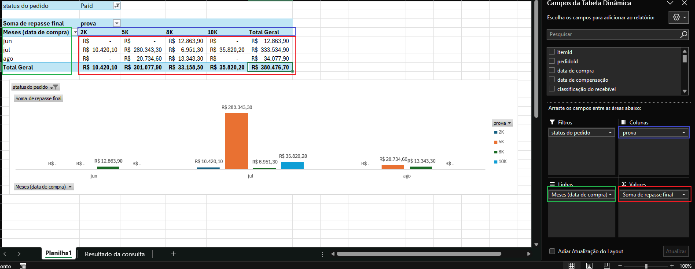
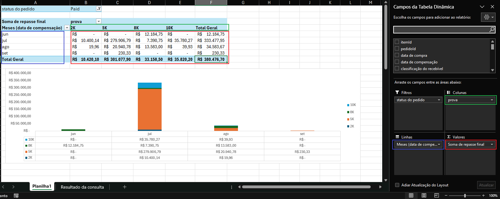
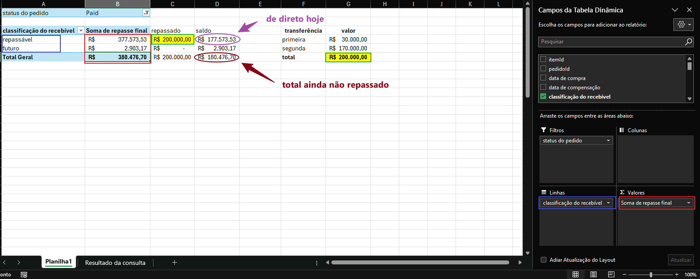
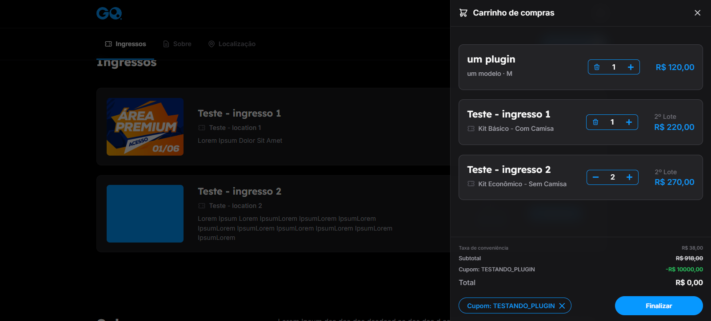
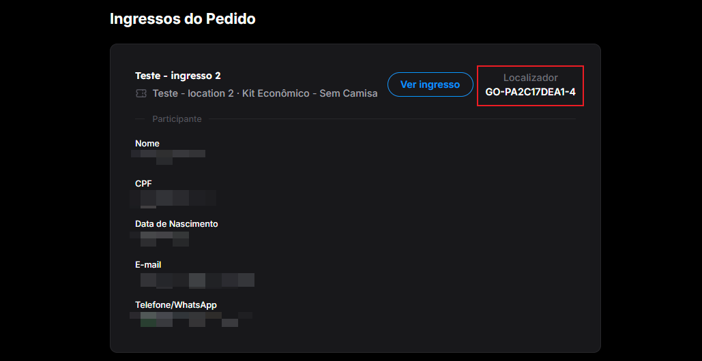
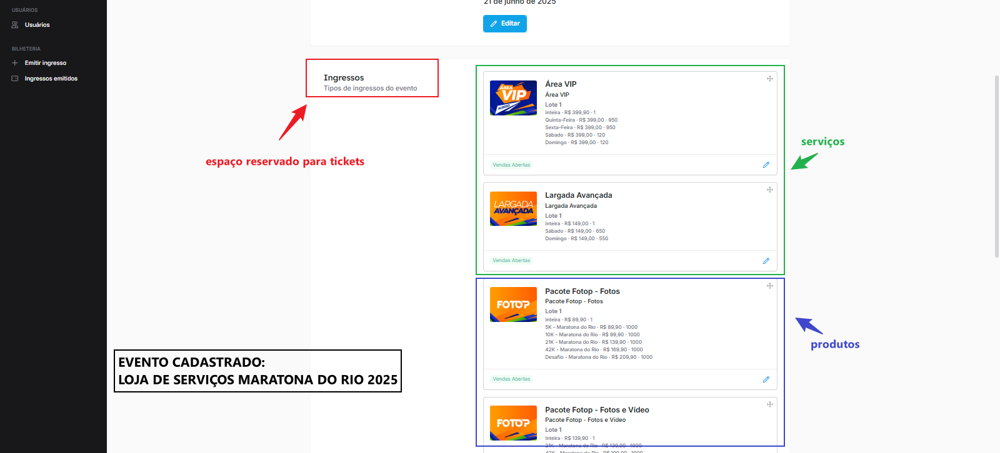

# 1. RECEBÍVEIS

Este é um guia de recebíveis para fins de compreensão dos campos da tabela. Consulta mais completa possível no banco de dados para buscar atender a **todos os eventos** de maneira **escalável**. Foca totalmente na estrutura desenvolvida durante o 2º semestre de 2024 - portanto, edições anteriores não funcionarão, nem mesmo da plataforma antiga. O script da consulta pode ser visto no arquivo `recebiveis.sql`. Das colunas:

### 1.1. Schema da tabela

* **itemId:** Número do item dentro do pedido. Entenda-se por item um ticket, produto ou serviço.
* **pedidoId:** Número do pedido. Pedido é um carrinho/checkout na plataforma.
* **data de compra:** Data que o checkout foi gerado, independente de ter sido ou não pago. Não se trata do recebimento de valores. Segue uma lógica de regime de competência ("Quanto vendi na data M?").
* **data de compensação:** Momento apurado de recebimento de pagamento de checkout. Para cartão, o momento de pagamento da referida parcela. Demais formas de pagamento, segue a data de compra. Segue uma lógica de regime de caixa ("Quanto recebi na data N?").
* **classificação do recebível:** Define se o registro/linha do recebível já é repassável ou um valor futuro. Regra com base à data de compensação: Se for uma data que já passou, é repassável (em teoria, recebido no gateway), caso contrário é um valor futuro.
* **semana de compensação:** Campo para agrupar semanalmente os valores por data de compensação.
* **edição:** Compreende toda uma edição de um evento, abarcando todos os 'sub-eventos' cadastrados (de uma mesma edição, público geral, cortesias, assessorias, patrocinadores, etc.).
* **evento:** O evento cadastrado em sí. O qual aparece na vitrine da plataforma para venda.
* **categoria:** Informa se o dado registro (linha) é um ticket, produto extra (plugin), serviço ou outro qualquer.
* **prova:** Para agrupar em distâncias de eventos de corrida, colocando no mesmo grupo. Ex.: '5k com camisa', '5k sem camisa', '5k vip' ficam sob o rótulo '5K', mesma distância.
* **ticket:** O nome do ticket efetivamente cadastrado na plataforma para venda ('5k com camisa', '5k sem camisa', '5k vip', etc.).
* **tipo do ticket:** Define se o ticket é inteira, meia-entrada, VIP, idoso, etc. Mesmo rótulo cadastrado na plataforma.
* **item fracionado:** Por ser uma tabela que a orientação são recebíveis (cada linha é uma movimentação financeira). Há repetição de itens. É a fração das repetições que a soma das frações do mesmo item totalizam uma unidade vendida. Facilita para responder perguntas como "Quantos tickets foram vendidos em cada prova?". Basta somar 'item fracionado' e agrupar por prova via tabela dinâmica.
* **preço cadastrado:** O preço do lote que foi cadastrado. Não se trata do valor pago pelo ticket. Caso haja aplicação de cupom, haverá uma dedução.
* **status do pedido:** Identifica se o pedido foi pago ou não. Por óbvio, pedidos pagos que serão recebidos e repassados no momento apropriado (compensação).
* **status do item:** Identifica a situação de um item dentro do seu pedido. Apesar de pago, um ticket pode ter sido transferido para outrém, ou ter sido acionado o seguro (neste caso e por situações já ocorridas, repassável para o evento e o mesmo enviar o valor para a seguradora).
* **discriminação:** Complementar ao status do item.
* **ticket correlacionado:** Para identificar tickets na relação de transferência. Se há um itemId, há um outro ticket correlacionado que foi ou transferido ou recebido. A nível de repasse, tanto o ticket original quanto o valor da transferência devem ser repassados.
* **forma de pgto:** Além da forma de pagamento, mostra casos de cortesia (tickets gratuitos). Quando não já um método de pagamento atrelado ao pedido e este consta pago, trata-se de uma cortesia. Ou seja, um ticket de um evento cadastrado o qual os preços dos lotes são zero, ou o cupom aplicado é tão maior que o ticket e a conveniência somados a ponto de gerar um checkout de valor nulo.
* **gateway:** A adquirente que processou o pedido.
* **OR:** Idenficador do pedido na adquirente. Cada uma possui um formato próprio.
* **taxa do gateway:** A depender do gateway, da forma de pagamento, da bandeira e quantidade de parcelas (cartão), há uma cobrança percentual diferente no processamento do pedido. Incidido no valor total dele. Pois, para a adquirente, não existe distinção entre repasse, conveniência, juros, frete ou outro componente que venha a compor o valor final do checkout.
* **taxa de conveniência:** Percentual de remuneração da tiqueteira sobre tickets vendidos.
* **taxa de extras:** Percentual de remuneração da tiqueteira sobre extras vendidos.
* **taxa de emissão:** Percentual de remuneração da tiqueteira sobre a emissão de cada ticket. Por vezes, complementar à taxa de conveniência: Quando o evento não possui taxa de conveniência, o participante não paga a GoDream. Neste caso, provavelmente haverá uma cobrança de emissão pelo ticket a ser deduzido do valor líquido do ticket (preço do lote - desconto) que gerará um repasse do referido registro inferior ao preço líquido do ingresso.
* **fixo de emissão:** Similar à taxa de emissão. Mas, trata-se de um valor fixo por ingresso emitido. Necessitando de rateio.
* **taxa de reembolso:** Percentual de remuneração da ticketeira quando houver pagamento de seguro pelo ticket. Ainda, a maneira de identificar se os tickets estão contemplados por algum seguro é se há um valor designado para tal na tabela respectiva (se `checkoutsummary.ticketinsurance` > 0).
* **taxa de troca:** Percentual de remuneração da ticketeira sobre o valor da troca de titularidade de um ticket. Há sutilezas, havendo situações em que se cadastrou transferências como ingressos na plataforma, ou cadastro do valor de troca com a remuneração embutida ou não. A depender do caso, pode necessitar de refinamento.
* **taxa de rebate:** Percentual de cashback sobre a conveniência. Geralmente, não se trata de pontos percentuais, mas, de uma proporção relativa à taxa de conveniência: De 10% de conveniência, 2.5% de de cashback se traduz em 25% de conveniência devolvida ao produtor (e costumeiramente sobre a conveniência líquida, montante dos 10% abatidos de custos de gateway, demais custos e impostos). Ex.: "taxa de conveniência de 12%, a qual 3.5% devolvidos ao produtor a título de cashback":

```r
tx = 12%
rebate = 3.5%
ticketeira = tx - rebate = 12 - 3.5 = 8.5%
```

* **taxa de impostos:** Geralmente 14,25%.
* **parcelas:** Quando diferente de cartão, sempre será 1.
* **parcela:** Número da parcela da compra. Quando diferente de cartão, será o próprio registro. Para cartão, os valores são divididos entre cada parcela.
* **emissão percentual GD:** Valor de remuneração da ticketeira referente à emissão de tickets na modalidade de cobrança percentual.
* **emissão fixa GD:** Valor de remuneração da ticketeira referente à emissão de tickets na modalidade de cobrança fixa.
* **total do item parcelado:** O valor total da parcela do item de um pedido. Ex.: Um carrinho pago em 3 vezes com 2 tickets de R$50/cada à 10% de conveniência e R$40 de juros:

```r
R$ pedido = [∑ (tickets x preço)] x (1 + tx)  + adicionais = 2 x 50 x 1.1 + 40 = R$ 150
R$ item/pedido = R$ pedido / M parcelas = 150 / 2 = R$ 75
R$ parcela/item = R$ item/pedido / N itens = 75 / 3 = R$ 25
```

* **preço cadastrado parcelado:** O valor cadastrado do lote do ingresso de forma parcelada.
* **desconto parcelado:** O valor parcelado de desconto concedido via cupom. Para tickets de cortesia, o valor do cupom deverá ser no valor cadastrado do lote embutida a taxa de conveniência sobre ele. Ex.: ticket por R$100 com taxa de 10%, cupom de 100 x 1.1 = R$110 de desconto.
* **repasse de items:** Montante de direito do evento, no referido momento de compensação, apenas sobre o preço do item em questão (ticket, plugin, serviço). Caso 'data de compensação' seja o hoje ou inferior, é um valor que o produtor tem direito a receber. Caso contrário, é um valor futuro.
* **conveniência parcelada:** Montante de conveniência, receita da GoDream, dentro da parcela em questão.
* **troca parcelada:** Montante parcelado do serviço de troca de titularidade do ticket. Abarca o montante de repasse como de remuneração da ticketeira pelo serviço prestado.
* **repasse parcelado de troca:** Do valor em 'troca parcelada', o valor de direito do evento.
* **troca GD parcelada:** Do valor em 'troca parcelada', o valor de direito da ticketeira.
* **reembolso parcelado:** Montante parcelado do serviço de seguro do ticket. Abarca o montante de repasse como de remuneração da ticketeira pelo serviço prestado.
* **repasse parcelado de reembolso:** Do valor em 'reembolso parcelado', o valor de direito do evento.
* **reembolso GD parcelado:** Do valor em 'reembolso parcelado', o valor de direito da ticketeira.
* **juros parcelado:** Montante de juros na referida parcela, provenientes de compras no cartão. Receita da ticketeira.
* **frete parcelado:** Montante de frete na referida parcela. Até última instância, não repassável na medida que o frete é pago pela ticketeira.
* **repasse final:** Total de repasse do referido recebível (linha) considerando valor líquido dos tickets, seguro, deduções de emissão/comissão, trocas de titularidade.
* **conveniência líquida parcelada:** Receita líquida de conveniência para fins de rebate. Do valor monetário de conveniência, deduz-se custos de adquirente e demais encargos, caso aplicável, e, por fim, a dedução de impostos. Lembrando que o custo de adquirente é sobre o pedido, e não sobre um componente em específico. Ex.: Um pedido com 3 tickets, de R$ 40, R$ 60, R$80, respectivamente, a uma taxa de conveniência de 10% comprados no cartão em 2 vezes com um cartão Master transacionado na PagSeguro (2.39% de custo de adquirente), custos de infra de R$0.55/pedido e 14.25% de impostos: 

```r
R$ checkout = (40 + 60 + 80) x 1.1 = R$ 198
R$ custo de adquirente = 0.0239 x 198 = R$ 4.73
R$ conveniência líquida = (198 - 4.73 - 0.55) x (1 - 0.1425) = R$ 165.26
R$ conveniência líquida parcelada = 165.26 / 2 = R$ 82.63
```

* **custos fixos de gateway:** Valores fixos cobrados pela adquirente sobre o processamento do carrinho. Como demais valores fixos, devem ser rateados.
* **custo de gateway:** Valor financeiro deduzido pela adquirente pelo processamento da compra. Compreende tanto custos fixos por processamento de checkout como percentuais. Este último, a taxa depende da forma de pagamento e, quando cartão, da bandeira e quantidade de parcelas.
* **rebate:** Valor de cashback a ser dedolvido ao evento. Não está abarcado em 'repasse final'.

### 1.2. Exemplos

Com uma base de uma determinada edição XPTO exportada, algumas situações que podem ser facilmente respondidas via planilha e tabela dinâmica são exemplificadas abaixo.

#### 1.2.1. Exemplo 1:

Gerando uma visão de lotes para observar quantos tickets e o repasse total de cada lote de um evento cadastrado:


Não há campo que diga o número do lote (lote 1, 2, 3, etc). Mas, por consenso, o preço cadastrado de um ticket define o seu lote, levando em consideração que para um mesmo evento > ticket > tipo do ticket o valor do lote seguinte é obrigatoriamente superior ao lote anterior. Pela imagem acima, o evento `XPTO C` somente vendeu `kit premium` do ingresso `5K - sem camisa` e possui lotes nos valores de R$ 129,90 e R$ 139,90, sendo primeiro e segundo lote, respectivamente.

#### 1.2.2. Exemplo 2:

Quanto o produtor obteve financeiramente sobre as vendas (competência) mensalmente em cada prova:



Venda independe do momento de recebimento. Ajuda a diagnosticar o potencial do negócio. Caso um evento venda poucos tickets mas seus preços sejam muito altos, o faturamento também o será. O mesmo se pode dizer de eventos cujos preços sejam muito baixos, mas que tenham muitos tickets vendidos.


#### 1.2.3. Exemplo 3:

O fluxo mensal de recebimentos (caixa real) separados por prova:



O fluxo de recebimento considera o momento de depósito em conta. O capital é diluído em um período maior por conta de vendas em cartão de crédito. Caso todos os pedidos tivessem sido pagos por outro meio de pagamento, o fluxo da imagem acima seria igual ao da imagem do exemplo 2. 

Imagine que se vendeu um carro por R$ 30.000. No momento de compra houve algum recebimento desse montante? A resposta é depende. Caso tenha sido em 3 vezes, no momento da compra não se tem qualquer valor, e se terá R$ 10.000 cerca de 30 dias depois da data de compra.

#### 1.2.4. Exemplo 4:

Quanto é de direito do produtor a receber hoje considerando que ele já tenha recebido 2 transferências de repasse nos valores de R$ 30.000 e R$ 170.000:



Separando o repasse total pela classificação do recebível, facilmente se observa quanto ele tem de direito a receber. Mas, não há integração com bancos a ponto de consultar as transferências via banco de dados. Todavia, não importa quando ele recebeu os R$200.000 mas sim que ele os recebeu, sendo apenas tirar a diferença entre o total de direito hoje e o que já foi recebido.


# 2. CUIDADOS 

### 2.1. Plugins/serviços e cupons

Teoricamente, extras não deveriam receber desconto de cupom por conta de regras de negócio. Contudo, não há impedimento para aplicar um cupom com desconto tão alto a ponto de zerar a cobrança de plugins dentro de um carrinho.

 

Acima, um cupom `TESTANDO_PLUGIN` que dá direito a R$ 10.000 de desconto foi aplicado em um checkout com 3 tickets, 1 `Teste - ingresso 1` e 2 `Teste - ingresso 2`, e 1 plugin, `um plugin`. Caso no checkout houvesse alguma validação sobre os itens do carrinho para aplicar desconto somente nos tickets (o correto), o valor a ser pago em `Total` deveria ser no valor do próprio plugin de R$ 120 (sem taxa de conveniência, uma vez que não há cobranças sobre plugins), descontando somente R$ 836 dos tickets e conveniência respectiva (`checkout = [220 + 270 + 270] x 1.1`). Entretanto, o valor do checkout é nulo.



```
id    |sessionid|trackingCode   |
------+---------+---------------+
486315|   726886|GO-PA2C17DEA1-4|
```

A modelagem construída do banco de dados não registra maiores detalhes do carrinho. Somente valores aglutinados de cada componente do checkout. Do mesmo pedido acima (726886), na tabela `checkoutsummary`:

```sql
select * from checkoutsummary where sessionid = 726886;
```

```
id   |sessionId|totalAmount|ticketsValue|productsValue|discount|interest|freight|tax |ticketInsurance|ticketTransfer|
-----+---------+-----------+------------+-------------+--------+--------+-------+----+---------------+--------------+
74999|   726886|    -9082.0|       760.0|        120.0| 10000.0|     0.0|    0.0|38.0|            0.0|           0.0|
```

A informação financeira do checkout se resume a uma única linha, com os valores totais de tickets (`ticketsValue`), extras (`productsValue`), descontos de cupom (`discount`), etc. Não há informação sobre quanto foi pago nesse pedido referente a um ou outro ticket/extra, ou qual ticket está efetivamente abarcado em algum seguro (apenas que no pedido foi pago por algum seguro devido à `ticketInsurance` ser 0 ou não), ou qual item no carrinho recebeu desconto de cupom.

Não somente, não há validação de valor do checkout quando o desconto for superior ao valor do checkout (caso contrário, `totalAmount` deveria ser zero e não -R$ 9.082). O esperado, seria um `totalAmount` de R$ 120. Não um valor nulo - muito menos um valor negativo. 

De modo geral, situações assim, com **cupom de desconto superior aos tickets e demais produtos, geram um repasse maior**, pois, via de regra, `discount` é rateado somente sobre os tickets mantendo o valor dos extras intactos. Mas, fato é que a pessoa do pedido teste acima não pagou qualquer item **por ausência de validação adequada de regras de negócio durante o checkout**.

Outro ponto diz respeito às cortesias. Houve situações de criação de cupons de desconto para gerar cortesias em eventos cadastrados não destinados para cortesias. Para alguns destes eventos, havia a presença de plugins para compra. O meio mais simples de identificar uma cortesia é se houve um meio de pagamento - caso não possua, não ocorreu transação em gateways, sendo uma cortesia. 

Caso a cortesia seja gerida via cupom, para um pedido com múltiplos tickets mas que tenha sido aplicado um cupom de cortesia válido para um único ticket, avaliar qual é o ticket de cortesia se torna inviável devido à estrutura de rateio proporcional ao valor de cada ticket. Neste cenário, dever-se-ia imputar a um ticket específico o valor do desconto. Para este cenário, o cupom de cortesia somente pode valer para um carrinho que contenha um único ingresso (há parametrização na plataforma para isso). Caso o evento contenha produtos extras, o cupom deve ser do tipo fixo no valor do ticket e acrescido da taxa de conveniência - caso fosse percentual, também eliminaria o valor de todos os extras colocados no carrinho.

**Portanto, levando em consideração a modelagem e ausência de validação de regras de negócio:**

* **Em eventos que não de cortesias e que não contenham extras:** Limitação apenas quando o desejo é emitir cortesias via cupom, que devem valer apenas para carrinhos com ticket único;
* **Em eventos que não de cortesias e que contenham extras:** O ideal é cadastrar cupons de **desconto fixo** no montante exato dos tickets e de sua taxa cobrada.

### 2.2. Plugins e serviços cadastrados como ticket no admin

Em alguns cenários, a fim de atender a demandas específicas de produtores, cadastra-se produtos ou serviços em campos reservados para ingressos no backoffice. O que significa que a regra de cálculo aplicada sobre esses casos é de ingressos, impactando valores de conveniência, demais cobranças, etc. 



O mais coerente seria cadastrar tickets e, sobre eles, plugins. Mas, caso o método de cadastro de eventos de cross-selling sejam como o esboçado acima, a forma mais simples é corrigir discrepâncias no borderô, observando desvios na própria planilha exportada e alterando casos isolados.

### 2.3. Cálculo de rebate para diferentes negociações

A depender da negociação, o campo de rebate parametrizado não atenderá a certos tipos de acordos comerciais. O mais prático é apurar o rebate via planilha exportada. Casos de rebate considerando somente a dedução de impostos, por exemplo, basta abater impostos da conveniência na planilha e, do valor resultante, apurar o rebate.

